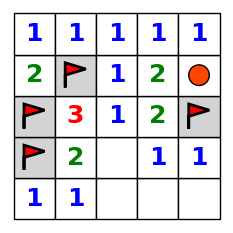
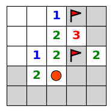

# Minesweeper Knowledgebase Agent

This study explores inference-informed behavior in agents designed to play Minesweeper.  
 
Three agents that are able to play and solve a game of Minesweeper are conceptualized and
developed. Each agent uses a different approach to represent the state of the game board and uses different
strategies to infer the locations of mines and safe cell positions. The performance of each of the agents
is compared on efficiency and performance. The best performing agent (CNF Agent) utilizes a knowledge
consisting of logical clauses represented in conjunctive-normal form (CNF). The choice to represent the
agent’s knowledge and percepts in this way allows for faster querying using satisfiability solvers. In addition,
the CNF Agent outperforms the others in performance because it is able to make logical, rational inferences
about the state of the board using the entire frontier of uncovered cells. Further exploration is done to assess
how this agent would perform given unreliable perception of its environment.

## Visualization 

Visualization of the game board is built into the object and is based off of the matplotlib library.  Flags appear as
red triangles. Uncovered mines (mines that have exploded) appear as red circles. Mine counts appear as
colored text within the cell, except in the case where the mine count is 0.   

  

      
  

  

    
  

## Dev Notes 

> 2019-10-14  
mergenotes   
+ Merging roshan with master. 
    + Implements CNF_total_agent.  This agent adds total mine clauses to the KB before solving
    + Warning, this agent does not do well with large dimension mazes 

> 2019-10-12   
mergenotes  
+ Merging roshan with master
    * Implemented CNF solver and smartypants solver (not so smart) 