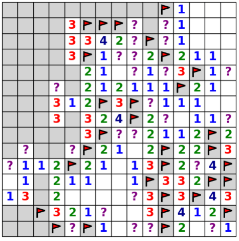
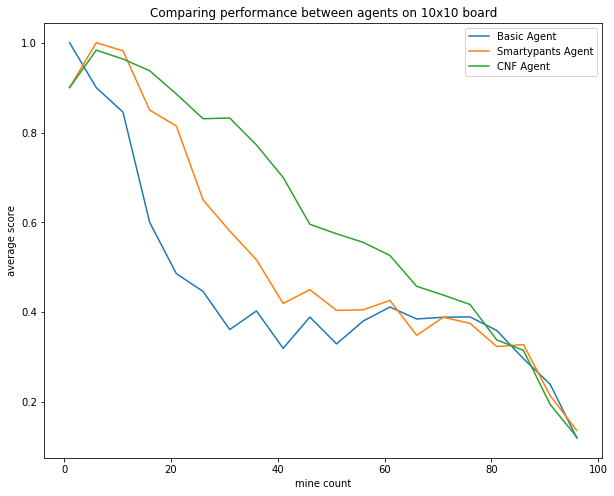

# Minesweeper Knowledgebase Agent

This study explores inference-informed behavior in agents designed to play Minesweeper.  
 
Three agents that are able to play and solve a game of Minesweeper are conceptualized and
developed. Each agent uses a different approach to represent the state of the game board and uses different
strategies to infer the locations of mines and safe cell positions. The performance of each of the agents
is compared on efficiency and performance. The best performing agent (CNF Agent) utilizes a knowledge
consisting of logical clauses represented in conjunctive-normal form (CNF). The choice to represent the
agent’s knowledge and percepts in this way allows for faster querying using satisfiability solvers. In addition,
the CNF Agent outperforms the others in performance because it is able to make logical, rational inferences
about the state of the board using the entire frontier of uncovered cells. Further exploration is done to assess
how this agent would perform given unreliable perception of its environment.

## Visualization 

Visualization of the game board is built into the object and is based off of the matplotlib library.  Flags appear as
red triangles. Uncovered mines (mines that have exploded) appear as red circles. Mine counts appear as
colored text within the cell, except in the case where the mine count is 0.   

## Basic Agent 
The premise of the basic agent is to perform local searches around an uncovered, safe cell to determine
if it can conclude one of the following:
+ All covered, unflagged neighboring cells are mines If the mine count on the cell is equal to the number of covered, unflagged neighbors around the cell, then all those neighbors around the cell are mines.
+ All covered, unflagged neighboring cells are not mines

If the number of safe neighbors of a cell is equal to the number of covered, unflagged neighbors around
the cell, then all those neighbors around the cell are mines. If one of the two above situations is not available on the board, then the basic agent will randomly uncover
a covered, unflagged cell on the board

The basic agent is able to deterministically infer the locations of mines and safe cells using its simple condition
checks on single cells and its immediate neighbors. However, it does not take advantage of the knowledge
gained across the frontier of uncovered cells.  Because of this, this agent fails to glean information about the hidden state of some cells when there is enough information to deduce their states.   

## Smartypants Agent 

The Smartypants agent’s knowledgebase is a formal definition of the state of the board using variables. The variable used is M(i, j). M(i, j) is true when there is a mine at cell location (i, j). −M(i, j) evaluates to true when there is
not a mine at cell location (i, j)–that is, it is a safe cell. When a mine count is discovered from uncovering a
safe cell, a set of clauses are added to the knowledgebase.
  
Let cell at (i, j) have q mine neighbors (its mine count is q) and n neighbors. We can generate (n choose
q) clauses where in each clause, q of the neighbors are mines (M(neighbor)) and n-q of the neighbors are
not mines (-M(neighbor)). The clause is a conjunction of these literals. Each clause describes a possible
scenario that could satisfy the mine count requirement for that cell. Thus, each clause is joined together via
a disjunction. Each cell on the game board will have a disjunction of conjunction of mine literals. The set of
all these disjunctions represent the agent’s knowledgebase.

Although it performs better than the trivial, basic agent, it cannot make inferences using knowledge gained across the frontier of known cells. In order to do this, we need to revise the knowledgebase so that it forms into a satisfiability problem. Instead, the knowledgebase is severed between cells and not sitting together in a soup of knowledge. If the clauses were simmering together, the agent could query the knowledgebase about the truth value of a particular cell and benefit from the information across the frontier of known cells.  

## CNF Agent 

This agent’s knowledgebase is inspired by the flaws of the Smartpants agent. In particular, we saw that we needed to represent the statements of the knowledgebase in the agent in conjunctive normal form in order for a satisfiability solver to efficiently operate over it.  

The agent's knowledgebase stores two lists. One is a list of Clause objects. This represents the conjunction of
disjunctions of Variables. This will always be in conjunctive normal form (CNF). The second list is a list of
integers where each integer is an index ID for a cell. This is to enable easy integration with an external SAT
solver library named pycosat. Pycosat is a light Python wrapper over the C++ implementation of picosat.
The object also stores a set of cell coordinates. This is used for reducing the runtime of solving a satisfiability
problem–the SAT solver will not execute if the cell coordinates are not in the set attribute.   

Using the pycosat library, we can efficiently query the knowledgebase to see if a query statement is consistent with it. The query statements will be statements asking if cell (i, j) is a mine or if cell (i, j) is not a mine. Verifying consistency is difficult, so we can tweak this to represent it as a satisfiability problem.  

## Comparison

  

## Dev Notes 

> 2019-10-14  
mergenotes   
+ Merging roshan with master. 
    + Implements CNF_total_agent.  This agent adds total mine clauses to the KB before solving
    + Warning, this agent does not do well with large dimension mazes 

> 2019-10-12   
mergenotes  
+ Merging roshan with master
    * Implemented CNF solver and smartypants solver (not so smart) 